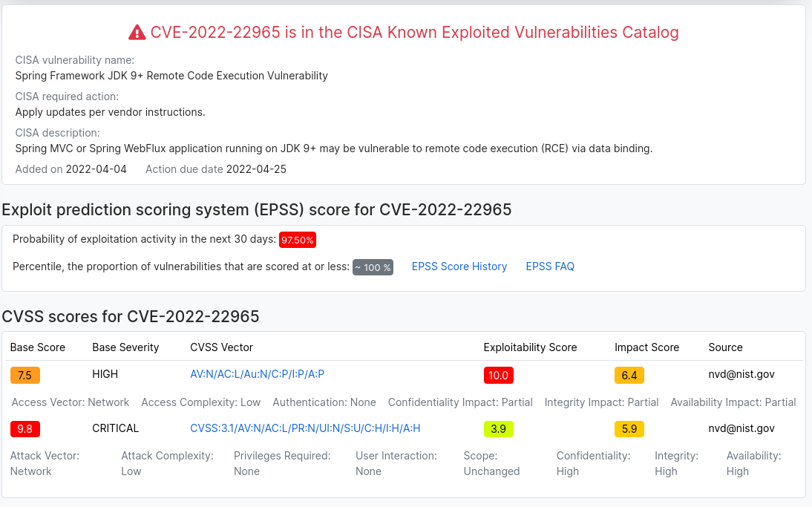

<!-- _class: lead -->

  

# **Who are my roommates?**

*SBOM to know better your dependencies*

---
<!-- _class: lead -->

# $ whoami

Olivier Gatimel, Java developer since 2009
Lead dev @CARL Berger-Levrault, a CMMS software editor

---

# Agenda

* What is a SBOM ?
* SPDX and CycloneDX explained
* Tools to generate SBOM
* Tools to analyze SBOM
* Some formats to exchange vulnerabilities

---

# What is a SBOM ?

_Software Bill of Materials_

* A list of ingredients that make up software components
* Machine-readable document
* Provides mainly component identifier, hashes, license

➡️ For Java users: not to be confused with Maven BOM, which is an indication of versions to use in a project

---

# Usages

* Legal department: license compliance
* Exploitation: current vulnerabilities
* Others: OSS libraries health check, Readme, ...

---


# SPDX

_Software Package Data eXchange_

* Started in 2010, hosted by Linux Foundation
* ISO/IEC 5962:2021
* Made first for license management: https://spdx.dev/ids/
* Open standard for SBOMS

---


# CycloneDX

* Started in 2017, backed by OWASP Foundation
* Last release in January 2022 with version 1.4
* More than SBOM : VEX, HardwareBOM, VDR, ...

---

# SPDX or CycloneDX

* SPDX license list is the reference (~300 entries)
* CycloneDX is more efficient for vulnerability management
* Conversion tools exists (but some information could be lost)

---

# Identifiers are important !

* You want to be precise about what you have
* Fuzzy matching is not perfect

---

# Some identifier types

* Package URL (purl)
  * https://github.com/package-url/purl-spec
  * Maven example: `pkg:maven/group/barfoo@2.14.2`
  * Npm example: `pkg:npm/foobar@12.3.1`
* Common Platform Enumeration (CPE)
  * https://nvd.nist.gov/products/cpe
  * Example: `cpe:2.3:a:ntp:ntp:4.2.8:p3:*:*:*:*:*:*`

---

# SPDX identifier

```json
"name": "jackson-core",
"SPDXID": "SPDXRef-Package-java-archive-jackson-core-3475e1f30056bc6a",
"versionInfo": "2.14.2",
```

with sometimes

```json
"externalRefs":[{
  "referenceCategory":"PACKAGE-MANAGER",
  "referenceLocator":"pkg:maven/com.fasterxml.jackson.core/jackson-core@2.14.2",
  "referenceType":"purl"}
  ]}
```
---

# CyloneDX identifier

```json
"bom-ref":"pkg:maven/com.fasterxml.jackson.core/jackson-core@2.14.2
?package-id=3475e1f30056bc6a",
"cpe":"cpe:2.3:a:jackson-core:jackson-core:2.14.2:*:*:*:*:*:*:*",
"group":"com.fasterxml.jackson.core",
"name":"jackson-core",
"purl":"pkg:maven/com.fasterxml.jackson.core/jackson-core@2.14.2",
"type":"library","version":"2.14.2"
```

---

# Tools to generate

* [syft](https://github.com/anchore/syft): for containers or archives (CycloneDX, SPDX)
  * [paketo](https://paketo.io): use Syft to include sboms in app image
* [cdxgen](https://github.com/CycloneDX/cdxgen) : various supported languages (CycloneDX)
  * [Maven](https://github.com/CycloneDX/cyclonedx-maven-plugin) or [Gradle](https://github.com/CycloneDX/cyclonedx-gradle-plugin) plugin
* [SPDX Maven](https://github.com/spdx/spdx-maven-plugin) plugin
* Using [GitHub dependency graph](https://docs.github.com/en/code-security/supply-chain-security/understanding-your-software-supply-chain/exporting-a-software-bill-of-materials-for-your-repository) (SPDX)
* OpenTelemetry had an idea to create SBOM from traces metadata
* And probably many more!

---

# Some examples

Made from [paketo Java samples](https://github.com/paketo-buildpacks/samples) (spring-boot3 project)

:memo: **sample-java.plugin.cdx.json**
```
# Gradle plugin
$ gradle cyclonedxBom
```

:memo: **sample-java.plugin+syft.cdx.json**
```
# Enriched with Syft
$ syft packages file:sample-java.plugin.cdx.json -o cyclonedx-json
```

---

:memo: **sample-java.paketo.cdx.json**
```
# Extracted from paketo layers
$ pack sbom download samples/java --output-dir ./
cd layers/sbom/launch/paketo-buildpacks_executable-jar
```

:memo: **sample-java.syft.cdx.json**
```
# Paketo image analyzed by Syft
$ syft packages docker:samples/java -o cyclonedx-json
```

---

# With some differences between tools

| Source   | Number of deps |
| -------- | -------------- |
| Gradle (project)  | 58    |
| Syft (Gradle CycloneDX)  | 58    |
| Paketo (layer)  | 54      |
| Syft (image) | 341        |

---

### Gradle plugin ≠ Gradle+Syft

➕
**cpe**: `cpe:2.3:a:jackson-core:jackson-core:2.14.2:*:*:*:*:*:*:*"`
**properties**: syft properties

➖
**description**: pom description
**externalReferences**: project vsc
**group**: maven group
**hashes**: jar hashes
**modified**: deprecated field

---

### Gradle plugin ≠ Paketo

➕ `spring-boot-starter-*`

➡️ Because in another paketo layer

➖ `jctools-core`

➡️ Not found by Gradle plugin?

---


# The fat-jar hidden roommates

* Fat/uber jars don't have transitive dependencies
* But they include dependencies in their archive

➡️ SBOM should show them

---

# Example with netty-common

Shade `org.jctools` as `io.netty.util.internal.shaded.org.jctools`

* Not in [pom dependencies](https://repo1.maven.org/maven2/io/netty/netty-common/4.1.90.Final/netty-common-4.1.90.Final.pom)
* But information in `META-INF/maven` poms in fat-jar archive

➡️ Syft uses Jar and Gradle plugin uses graph dependencies

---

<!-- _class: lead -->

# **Mixing tools is important!**

and you have to override some information sometimes

---

# Some tools to analyze SBOM

* Sonatype BOM Doctor : online CycloneDX SBOM scanner
  * https://bomdoctor.sonatype.com/
* Dependency-track: self-hosted webapp
  * https://dependencytrack.org/
* Grype: cli tool
  * https://github.com/anchore/grype
* Trivy: cli tool
  * https://github.com/aquasecurity/trivy

---

# Dependency-track

* OSS project, [developed by OWASP](https://dependencytrack.org/) since 2013
* Only support CycloneDX
  * Won't support SPDX (GH#1222)
* CSAF in progress
* Multiple vulnerabilities sources : NVD, Github, Snyk, ...
* Policy management for license and vulnerabilities
* Multiple projects and tracking over time

---


---

# License compliance

* A SBOM with license info can be an artifact for OpenChain conformance
  * An open source license compliance program (ISO/IEC 5230)
  * https://www.openchainproject.org/
* Should (must ?) use SPDX license id to help analysis

---

# Vulnerabilities report

* A SBOM is quickly huge!
* Not all vulnerabilities on all dependencies are applicable
* Clients want to know exploitable vulnerabilities

---

# VDR ( Vulnerability Disclosure Report)

A list of all known vulnerabilities from a vendor

In a nut shell:
* SBOM for dependencies list
* VDR for vulnerabilities list

---

# But is it exploitable ?

* CVSS: **C**ommon **V**ulnerability **S**coring **S**ystem
  *  A base score from 0 to 10, but the detail (CVSS Vector) is also important

* EPSS: **E**xploit **P**rediction **S**coring **S**ystem
  * Community driven effort to give a score (0 to 1) about the exploitation of a vulnerability

* KEV: **K**nown **E**xploited **V**ulnerabilities (Catalog)
  * A list of vulnerabilities exploited in the wild (maintened by CISA)

---


https://www.cvedetails.com/cve/CVE-2022-22965/

---

# VEX (Vulnerability Exploitability eXchange)

* Concept defined by CISA (Cybersecurity and Infrastructure Security Agency)
* Machine-readable document
* Indicate if software is affected by a vulnerability
* Contains statements:
  * vulnerability details
  * status: (not) affected, fixed, under investigation

---

# _Are you affected by CVE-XXXX ?_

* A vulnerability is not in your VDR or VEX
  * Because it is not linked to your dependencies
  * And you don't have a false positive (thanks to good identifiers)
* But this vulnerability made the news (think Log4J...)
* Now you have to communicate about it 😑

➡️ Some people suggest to list **all** vulnerabilities in VEX file

---


#  A word about CSAF

* Managed by OASIS Open
* Version 2.0 out since last november
* Enable to disclose and consume security advisories in machine readable format
* Specify distribution and discovery of CSAF documents
* Not a CVE replacement
* https://oasis-open.github.io/csaf-documentation/faq.html

---

# Example with RedHat

CSAF 2.0 publishing since February 2023
* https://www.redhat.com/fr/blog/csaf-vex-documents-now-generally-available
* https://access.redhat.com/security/data/csaf/v2/advisories/

---

# To sum up

* Mix tools to generate SBOM
* Use clear identifiers for components (purl, cpe)
* Load SBOM in various tools to check if identifiers are understood
* Track your dependencies
* Still a debate between publishing 
  * a document of only exploitable vulnerabilities
  * a document of all vulnerabilities responses
  * or both ?

---

# Some links to go deeper

* CISA definitions : https://www.cisa.gov/sbom
* CycloneDX specification : https://cyclonedx.org/specification/overview/
* CSAF FAQ : https://oasis-open.github.io/csaf-documentation/faq.html
* VDR vs VEX : https://owasp.org/blog/2023/02/07/vdr-vex-comparison